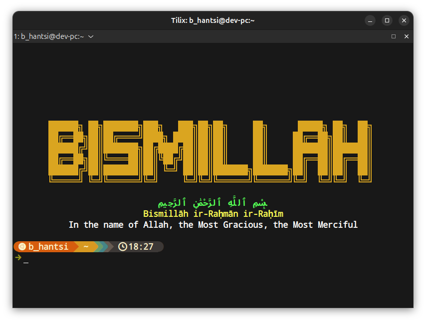

# 🌙 Tasmiyah-CLI

> A beautiful, fast terminal greeting that prints **Bismillah** and other Islamic phrases — written in Rust.

[](https://www.rust-lang.org/)
[](LICENSE)
[]()
[](https://github.com/bhantsi/tasmiyah-cli/actions/workflows/ci.yml)
[](https://github.com/bhantsi/tasmiyah-cli/actions/workflows/release.yml)
[](https://crates.io/crates/tasmiyah-cli)

<p align="center">
  
</p>

---

## ✨ Overview

`tasmiyah-cli` is a tiny terminal utility — in the spirit of
[`neofetch`](https://github.com/dylanaraps/neofetch),
[`cowsay`](https://github.com/piuccio/cowsay), and
[`fortune`](https://en.wikipedia.org/wiki/Fortune_(Unix)) — that prints
**بِسْمِ ٱللَّٰهِ ٱلرَّحْمَٰنِ ٱلرَّحِيمِ**
(*"In the name of Allah, the Most Gracious, the Most Merciful"*) every
time you open your terminal.

- 🪶 **Fast** — single static binary, ~1–5 ms startup.
- 🎨 **Three layouts** — centered ASCII logo (default), classic unicode box, or minimal text.
- 🌍 **Eight phrases** — Basmala, Alhamdulillah, SubhanAllah, Allahu Akbar, and more.
- 🧩 **Cross-platform** — Linux, macOS (Apple Silicon + Intel), and Windows.
- 🚦 **Script-safe** — auto-detects pipes and disables colors; honors `NO_COLOR`.

---

## 📦 Install

Pick one channel.

### Cargo (any platform with Rust)

```bash
cargo install tasmiyah-cli
```

Drops the binary into `~/.cargo/bin/` (already on your `PATH` if you used
`rustup`).

### Homebrew (macOS / Linux)

```bash
brew install bhantsi/tap/tasmiyah-cli
```

### Prebuilt binary (no toolchain required)

Grab the archive for your platform from the
[Releases page](https://github.com/bhantsi/tasmiyah-cli/releases),
verify the `.sha256`, extract, and drop `tasmiyah` on your `PATH`:

```bash
# Linux x86_64 — static musl build, works on any distro
curl -L https://github.com/bhantsi/tasmiyah-cli/releases/latest/download/tasmiyah-x86_64-unknown-linux-musl.tar.gz \
  | tar -xz
sudo install -m 755 tasmiyah /usr/local/bin/tasmiyah
```

Archives are published for:

| Platform | Targets |
|---|---|
| Linux | `x86_64-unknown-linux-gnu`, `x86_64-unknown-linux-musl`, `aarch64-unknown-linux-musl` |
| macOS | `aarch64-apple-darwin`, `x86_64-apple-darwin` *(both native)* |
| Windows | `x86_64-pc-windows-msvc` |

---

## 🚀 Usage

```bash
tasmiyah                              # default: Bismillah banner
tasmiyah --translation                # add transliteration + English
tasmiyah --random                     # random phrase from the library
tasmiyah --style classic              # the v0.1 unicode-box layout
tasmiyah --style minimal              # plain text — ideal for shell prompts
tasmiyah --no-color                   # disable ANSI colors
tasmiyah --help                       # show every flag
```

Add one line to your shell rc to greet you on every new session:

```bash
# ~/.bashrc, ~/.zshrc, etc.
command -v tasmiyah >/dev/null 2>&1 && tasmiyah
```

📖 **Full documentation:** see the [**User Guide**](docs/USER_GUIDE.md) for
the flag-by-flag reference, recipes, shell integration for every major
shell (bash, zsh, fish, PowerShell, Nushell), environment variables, the
full phrase library, and troubleshooting.

---

## ⬆️ Upgrade

`tasmiyah` prints a short footer once a new version lands on crates.io.
Upgrade through the same channel you installed from:

```bash
cargo install tasmiyah-cli                            # Cargo
brew update && brew upgrade bhantsi/tap/tasmiyah-cli  # Homebrew
```

For the prebuilt binary, re-download the latest archive — the install
command above also works as an upgrade (it overwrites in place).

Silence the update footer with `export NO_UPDATE_NOTIFIER=1`.

---

## 🛠️ Build from source

```bash
git clone https://github.com/bhantsi/tasmiyah-cli.git
cd tasmiyah-cli
cargo build --release
./target/release/tasmiyah
```

Run the test suite and lints:

```bash
cargo test                                  # unit + integration tests
cargo fmt --all -- --check                  # formatting
cargo clippy --all-targets -- -D warnings   # lints
```

---

## 🤝 Contributing

Issues and PRs are welcome — new phrases, bug reports, packaging help,
or new platform support. Please run `cargo fmt` and `cargo clippy`
before opening a PR; CI enforces both.

Maintainers: the release process is documented in
[docs/RELEASING.md](docs/RELEASING.md).

---

## 📜 License

[MIT](LICENSE) © [bhantsi](https://github.com/bhantsi)

May this small tool be a reminder to start every task with His name.
**Bismillāh.** 🌙
